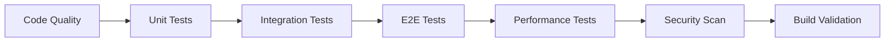

# Ninja Clan Wars - Deployment Guide

This guide covers the complete deployment process for the Ninja Clan Wars competitive card game, including CI/CD pipeline usage, environment management, and troubleshooting.

## 🏗️ Architecture Overview

### Technology Stack
- **Frontend**: Lit 3.0 PWA with Vite build system
- **Package Manager**: Bun 1.1.12
- **Architecture**: Monorepo (`apps/pwa` + `packages/game-core`)
- **Hosting**: Vercel (primary) + Netlify (backup)
- **CI/CD**: GitHub Actions

### Deployment Environments
- **Development**: Local development server (`bun run dev`)
- **Preview**: PR-based preview deployments
- **Staging**: Pre-production testing environment
- **Production**: Live gaming platform

## 🚀 Quick Start

### Prerequisites
1. **Bun**: Install Bun 1.1.12 or later
2. **GitHub**: Repository access with Actions enabled
3. **Vercel**: Account with deployment tokens
4. **Secrets**: All required GitHub secrets configured

### Basic Deployment Commands
```bash
# Development
bun run dev              # Start development server

# Production Build
bun run build           # Build production assets

# Testing
bun run test            # Run unit tests
bun run test:e2e        # Run E2E tests with Playwright

# Linting
bun run lint            # Run Biome linting
```

## 📋 CI/CD Pipeline Overview

### 1. Continuous Integration (ci.yml)
**Triggers**: Push to main/develop, Pull requests

**Pipeline Stages**:


**Jobs**:
- **Code Quality**: Linting, formatting, type checking
- **Unit Tests**: Cross-platform testing (Ubuntu, macOS, Windows)
- **Integration Tests**: Component integration validation
- **E2E Tests**: Full application flow testing with Playwright
- **Performance Tests**: Bundle analysis and Lighthouse CI
- **Security Scan**: Dependency audit and SAST with Semgrep
- **Build Validation**: Production build verification

### 2. Preview Deployment (preview.yml)
**Triggers**: Pull requests to main/develop

**Process**:
1. **Quick Validation**: Fast linting and build check
2. **Build Preview**: Create PR-specific build with metadata
3. **Deploy Preview**: Deploy to Vercel and Netlify preview URLs
4. **Preview Testing**: Smoke tests and performance validation
5. **Visual Regression**: Screenshot comparison testing
6. **PR Comments**: Automated deployment status updates

### 3. Production Deployment (deploy.yml)
**Triggers**: Push to main, Manual dispatch

**Process**:
1. **Pre-deployment Checks**: Critical tests and security validation
2. **Build Production**: Optimized production build with versioning
3. **Deploy to Vercel**: Primary production deployment
4. **Deploy to Netlify**: Backup deployment option
5. **Health Checks**: Post-deployment validation
6. **Rollback Plan**: Automatic failure recovery

### 4. Release Management (release.yml)
**Triggers**: Version tags (v*.*.*), Manual release creation

**Process**:
1. **Validate Release**: Comprehensive testing and version validation
2. **Build Release**: Create release assets with checksums
3. **GitHub Release**: Automated release creation with artifacts
4. **Auto-deploy**: Trigger production deployment for stable releases
5. **Post-release**: Team notifications and milestone creation

## 🔧 Environment Configuration

### Environment Variables
Variables are automatically set by CI/CD pipeline:

```bash
# Production
VITE_APP_VERSION=v1.2.3
VITE_APP_ENVIRONMENT=production
VITE_APP_BUILD_TIME=2023-12-01T10:30:00Z
VITE_APP_COMMIT_SHA=abc123def456

# Preview
VITE_APP_PR_NUMBER=42
VITE_APP_ENVIRONMENT=preview
```

### GitHub Secrets
See [SECRETS.md](../.github/SECRETS.md) for complete configuration.

**Required**:
- `VERCEL_TOKEN`, `VERCEL_ORG_ID`, `VERCEL_PROJECT_ID`

**Optional**:
- `NETLIFY_AUTH_TOKEN`, `NETLIFY_SITE_ID`
- `CODECOV_TOKEN`, `SLACK_WEBHOOK_URL`

## 📊 Performance Monitoring

### Performance Budgets
Defined in `performance-budget.json`:

- **FCP**: < 2000ms
- **LCP**: < 2500ms  
- **TBT**: < 300ms
- **CLS**: < 0.1
- **Bundle Size**: < 2MB total

### Monitoring Schedule
- **Lighthouse**: Every 6 hours via scheduled workflow
- **Core Web Vitals**: Real-time monitoring on production
- **Load Testing**: Manual triggers for stress testing

### Performance Alerts
Automatic alerts via Slack and GitHub issues when:
- Performance budgets exceeded
- Core Web Vitals regressions detected
- Load test failures

## 🎯 Deployment Workflows

### 1. Feature Development
```bash
# 1. Create feature branch
git checkout -b feature/ninja-battle-system

# 2. Develop and test locally
bun run dev
bun run test

# 3. Create pull request
# → Triggers preview deployment
# → Runs CI pipeline
# → Creates preview environment

# 4. Review and merge
# → Triggers production deployment
```

### 2. Hotfix Deployment
```bash
# 1. Create hotfix branch from main
git checkout -b hotfix/critical-bug-fix

# 2. Apply fix and test
bun run test

# 3. Create PR with emergency label
# → Fast-track CI pipeline
# → Immediate preview deployment

# 4. Emergency merge
# → Skip optional checks if needed
# → Immediate production deployment
```

### 3. Release Process
```bash
# 1. Create release tag
git tag v1.2.3
git push origin v1.2.3

# 2. Automated release creation
# → Comprehensive testing
# → Asset generation
# → GitHub release
# → Production deployment

# 3. Monitor deployment
# → Health checks
# → Performance validation
# → Team notifications
```

### 4. Manual Deployment
```bash
# Trigger manual deployment
gh workflow run deploy.yml \
  --ref main \
  -f environment=production

# Trigger manual release
gh workflow run release.yml \
  -f version=v1.2.3 \
  -f release_type=patch
```

## 🛠️ Troubleshooting

### Common Issues

#### Build Failures
```bash
# Check build locally
bun run build

# Verify dependencies
bun install --frozen-lockfile

# Check for TypeScript errors
bun x tsc --noEmit
```

#### Deployment Failures
1. **Vercel Issues**:
   - Verify `VERCEL_TOKEN` is valid
   - Check project configuration
   - Review deployment logs

2. **Test Failures**:
   - Run tests locally: `bun run test`
   - Check E2E test logs in artifacts
   - Verify test environment configuration

3. **Performance Issues**:
   - Review Lighthouse reports
   - Check bundle size analysis
   - Monitor Core Web Vitals

#### Secret Management
```bash
# List repository secrets
gh secret list

# Set secret
gh secret set VERCEL_TOKEN --body "your-token"

# Test secret access in workflow
gh workflow run deploy.yml --ref main
```

### Debug Commands
```bash
# Check workflow status
gh run list --limit 10

# View workflow logs
gh run view --log

# Download artifacts
gh run download RUN_ID

# Re-run failed workflow
gh run rerun RUN_ID
```

### Performance Issues
```bash
# Run local performance audit
bun x lighthouse http://localhost:5173 \
  --output html \
  --output-path lighthouse-report.html

# Check bundle size
bun run build
du -sh apps/pwa/dist/*

# Analyze bundle composition
bun x webpack-bundle-analyzer apps/pwa/dist/assets/*.js
```

## 🔒 Security Considerations

### Deployment Security
- All secrets stored in GitHub encrypted secrets
- Automatic dependency vulnerability scanning
- SAST security analysis with Semgrep
- Security headers configured in hosting

### Access Control
- Deployment requires GitHub Actions permissions
- Production deployments require manual approval
- Release creation restricted to maintainers

### Monitoring
- Audit logs for all deployment activities
- Security alerts for dependency vulnerabilities
- Performance monitoring for anomaly detection

## 📞 Support & Escalation

### Getting Help
1. **Documentation**: Check this guide and [SECRETS.md](../.github/SECRETS.md)
2. **Logs**: Review GitHub Actions workflow logs
3. **Local Testing**: Reproduce issues locally
4. **Team Support**: Contact DevOps team for assistance

### Emergency Procedures
1. **Production Down**: Use manual rollback via Vercel dashboard
2. **Security Issue**: Immediately contact security team
3. **Performance Degradation**: Trigger performance monitoring workflow

### Contacts
- **DevOps Team**: @devops-team
- **Security Team**: @security-team  
- **Release Manager**: @release-manager

## 📚 Additional Resources

### Documentation
- [Secrets Configuration](../.github/SECRETS.md)
- [Performance Budgets](../performance-budget.json)
- [Lighthouse Configuration](../.lighthouserc.js)

### External Links
- [Vercel Documentation](https://vercel.com/docs)
- [Netlify Documentation](https://docs.netlify.com)
- [GitHub Actions Documentation](https://docs.github.com/en/actions)
- [Lighthouse CI Documentation](https://github.com/GoogleChrome/lighthouse-ci)

### Monitoring Dashboards
- Vercel Analytics: [vercel.com/analytics](https://vercel.com/analytics)
- GitHub Actions: [github.com/actions](https://github.com/actions)
- Performance Reports: Artifacts in GitHub Actions runs